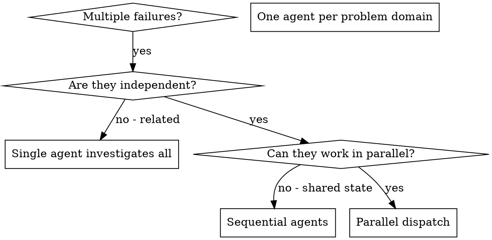

# Dispatching Parallel Agents

## Overview

When you have multiple unrelated failures (different test files, different subsystems, different bugs), investigating them sequentially wastes time. Each investigation is independent and can happen in parallel.

**Core principle:** Dispatch one fresh subagent session per independent primary goal. Let them work concurrently.

When `## Background-First Orchestration` is present, load `background-delegation` for scheduler and wait-mode decisions. This skill covers task independence, scope, and prompt quality; the background skill governs whether each independent lane runs blocking or background.

## Prerequisite: Check Runnable Tasks

Before dispatching, use `hive_status()` to get the **runnable** list — tasks whose dependencies are all satisfied.

**Only dispatch tasks that are runnable.** Never start tasks with unmet dependencies.

Only `done` satisfies dependencies (not `blocked`, `failed`, `partial`, `cancelled`).

**Ask the operator first:**
- Use `question()`: "These tasks are runnable and independent: [list]. Execute in parallel?"
- Record the decision with `hive_context_write({ feature: "feature-name", name: "execution-decisions", content: "..." })`
- Proceed only after operator approval

## When to Use



**Use when:**
- 3+ test files failing with different root causes
- Multiple subsystems broken independently
- Each problem can be understood without context from others
- No shared state between investigations

**Don't use when:**
- Failures are related (fix one might fix others)
- Need to understand full system state
- Agents would interfere with each other

## The Pattern

### 1. Identify Independent Domains

Group failures by what's broken:
- File A tests: Tool approval flow
- File B tests: Batch completion behavior
- File C tests: Abort functionality

Each domain is independent - fixing tool approval doesn't affect abort tests.

### 2. Create Focused Agent Tasks

Each agent gets:
- **Specific scope:** One primary goal, which may include tightly coupled code, tests, docs, and multiple files
- **Clear goal:** Make these tests pass
- **Constraints:** Don't change other code
- **Expected output:** Summary of what you found and fixed

Each native `task()` launch has one primary goal and one terminal handoff. Give complete constraints and acceptance criteria only for that goal. Point at catalog names and IDs rather than pasting every context body. Never pass `task_id` to `task()` or send a follow-up prompt to a completed, failed, or blocked session. Returned task IDs are observe-only board handles for status, reconcile, and cancel.

One implementation assignment normally maps to one numbered task. For an independently verifiable new deliverable, amend the DAG or create an append-only manual task. For ad-hoc work, use multiple fresh one-goal launches with disjoint path ownership or sequence overlapping writers.

### 3. Dispatch in Parallel

```typescript
// Gate-open only: use backgroundTaskCall when independent foreground work can continue.
const first = JSON.parse(await hive_worktree_start({ task: "01-fix-abort-tests" }))
task({ ...first.backgroundTaskCall })
const second = JSON.parse(await hive_worktree_start({ task: "02-fix-batch-tests" }))
task({ ...second.backgroundTaskCall })

// Blocking alternative, including every gate-closed session:
const blocking = JSON.parse(await hive_worktree_start({ task: "03-fix-cleanup-tests" }))
await task({ ...blocking.taskToolCall })
```

Independent Forager targets may be prepared and dispatched under one parent. Use `hive_worktree_start` for managed tasks, `hive_existing_workspace_start` for the exact active non-managed workspace, or the ad-hoc tools for isolated non-feature work. Preserve the returned `hive_launch_id`; do not invent one. Equality, aliases, and ancestor/descendant path overlap share one writer fence even when logical IDs differ. Active and uncertain reservations block conflicting preparation, dispatch, and lifecycle mutation. Treat installs, builds, formatters, generators, and tests as mutations. Ordinary Scout, advisor, and reviewer launches remain eligible for same-message parallel dispatch and omit `hive_launch_id`.

Use Forager-derived workers for delegated execution. A rare `general` capability exception requires a specific nonblank `hive_capability_reason` on native `task()` and no `hive_launch_id`. The reason declares the need without proving a capability gap. General receives ordinary tools only, no Hive authority, recursion, or questions. Native helpers retain bounded permissions. Both reserve the active root before dispatch; background return, errors, missing callbacks, deletion, and restart do not release ownership without exact child terminal evidence. An authenticated helper can operate under its own reservation while other overlapping writers remain fenced. Unknown targets remain denied. Hive's bounded Architect planning lane remains available, with project admission and mutation-tool leases. Existing placement supports only the exact active canonical checkout or genuine non-Git directory; real paths and Git metadata are revalidated at preparation, claim, and authority resolution. Try existing-workspace preparation before an independently authorized primary considers direct fallback for `unsupported_workspace_placement`. Conflict, authority, and internal failures never permit fallback. Existing-workspace workers verify, inspect effects and dirty state, and report without automatic commit, merge, reset, or cleanup. Worktree integration follows its authorized lifecycle.

Recover native binding from exact parent/call metadata only; never guess the latest child or infer ownership from prose. Preserve the workspace while a writer may still be live, and never copy its mutable progress. Retry managed task or ad-hoc work in the same worktree only after exact terminal or confirmed-cancelled evidence. Archive, restart, and preparation expiry do not release uncertain execution. See `background-delegation` for board recovery.
For read-only research, use `parallel-exploration`; this skill owns writing/change and execution dispatch.

```typescript
task({ subagent_type: '<chosen-advisor-or-reviewer>', prompt: 'Diagnose failure A and report without edits' })
task({ subagent_type: '<chosen-advisor-or-reviewer>', prompt: 'Diagnose failure B and report without edits' })
```

Choose the best-fit available descriptor for the requested output. Scout is for bounded source retrieval, not causal diagnosis or solution selection. A Forager diagnosis-only lane reports evidence, hypotheses tested and untested, a supported conclusion or unresolved status, and options when asked; it must not fix, edit, commit, or perform destructive reproduction unless the mission separately authorizes implementation in appropriate isolation.

### 4. Review and Integrate

When agents return:
- Read each summary
- Verify fixes don't conflict
- Run full test suite
- For managed task worktrees, integrate accepted changes with `hive_merge`.
- For ad-hoc worktrees, use the authorized `hive_adhoc_worktree_commit` and `hive_adhoc_merge` lifecycle.
- For existing-workspace execution, inspect effects and dirty state, then report; do not automatically commit, merge, reset, or clean up.

## Agent Prompt Structure

Good agent prompts are:
1. **Focused** - One clear problem domain
2. **Self-contained** - All context needed to understand the problem, as pointers and known facts, not a dump of every note
3. **Specific about output** - What should the agent return?

```markdown
Fix the 3 failing tests in src/agents/agent-tool-abort.test.ts:

1. "should abort tool with partial output capture" - expects 'interrupted at' in message
2. "should handle mixed completed and aborted tools" - fast tool aborted instead of completed
3. "should properly track pendingToolCount" - expects 3 results but gets 0

These are timing/race condition issues. Your task:

1. Read the test file and understand what each test verifies
2. Identify root cause - timing issues or actual bugs?
3. Fix by:
   - Replacing arbitrary timeouts with event-based waiting
   - Fixing bugs in abort implementation if found
   - Adjusting test expectations if testing changed behavior

Do NOT just increase timeouts - find the real issue.

Return: Summary of what you found and what you fixed.
```

## Common Mistakes

**❌ Too broad:** "Fix all the tests" - agent gets lost
**✅ Specific:** "Fix agent-tool-abort.test.ts" - focused scope

**❌ No context:** "Fix the race condition" - agent doesn't know where
**✅ Context:** Paste the error messages and test names

**❌ No constraints:** Agent might refactor everything
**✅ Constraints:** "Do NOT change production code" or "Fix tests only"

**❌ Vague output:** "Fix it" - you don't know what changed
**✅ Specific:** "Return summary of root cause and changes"

## When NOT to Use

**Related failures:** Fixing one might fix others - investigate together first
**Need full context:** Understanding requires seeing entire system
**Exploratory debugging:** You don't know what's broken yet
**Shared state:** Agents would interfere (editing same files, using same resources)

## Real Example from Session

**Scenario:** 6 test failures across 3 files after major refactoring

**Failures:**
- agent-tool-abort.test.ts: 3 failures (timing issues)
- batch-completion-behavior.test.ts: 2 failures (tools not executing)
- tool-approval-race-conditions.test.ts: 1 failure (execution count = 0)

**Decision:** Independent domains - abort logic separate from batch completion separate from race conditions

**Dispatch:**
```
Agent 1 → Fix agent-tool-abort.test.ts
Agent 2 → Fix batch-completion-behavior.test.ts
Agent 3 → Fix tool-approval-race-conditions.test.ts
```

**Results:**
- Agent 1: Replaced timeouts with event-based waiting
- Agent 2: Fixed event structure bug (threadId in wrong place)
- Agent 3: Added wait for async tool execution to complete

**Integration:** All fixes independent, no conflicts, full suite green

**Time saved:** 3 problems solved in parallel vs sequentially

## Key Benefits

1. **Parallelization** - Multiple investigations happen simultaneously
2. **Focus** - Each agent has narrow scope, less context to track
3. **Independence** - Agents don't interfere with each other
4. **Speed** - 3 problems solved in time of 1

## Verification

After agents return:
1. **Review each summary** - Understand what changed
2. **Check for conflicts** - Did agents edit same code?
3. **Run full suite** - Verify all fixes work together
4. **Spot check** - Agents can make systematic errors

## Real-World Impact

From debugging session (2025-10-03):
- 6 failures across 3 files
- 3 agents dispatched in parallel
- All investigations completed concurrently
- All fixes integrated successfully
- Zero conflicts between agent changes
