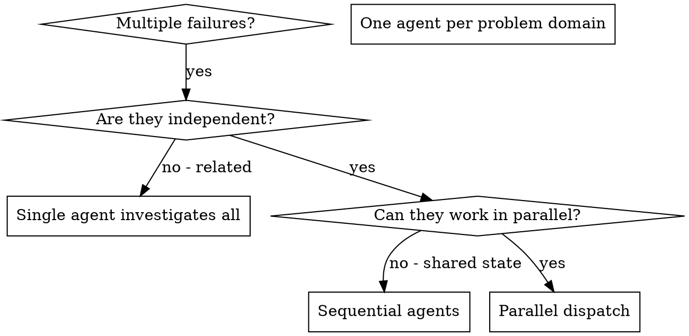

# Dispatching Parallel Agents

## Overview

When you have multiple unrelated failures (different test files, different subsystems, different bugs), investigating them sequentially wastes time. Each investigation is independent and can happen in parallel.

**Core principle:** Dispatch one primary goal per native `task()` invocation and expect one terminal handoff. Every returned result is terminal, so every follow-up uses a fresh child session and may reuse the same Hive task/worktree. Review findings are fresh assignments in the same implementation lane. Primaries must not pass `task_id` or infer continuation eligibility from task output, trace, board state, cancellation acknowledgement, or transcript quality. Pass `task_id` only when explicit operator instruction or runtime-owned interruption recovery authorizes continuation; otherwise launch fresh. If the child may still be active or its lifecycle is uncertain, inspect, wait, or reattach as supported; do not send another prompt or launch an overlapping writer. Compaction re-anchoring of a currently running worker is distinct from follow-up work. Trace recovery is untrusted and cannot authorize continuation. Parallel writes require disjoint registered worktrees (separate tasks or distinct ad-hoc runIds). Multiple writes in the same worktree must run sequentially.

### Worktree Concurrency & Sequencing
- **One writer per worktree:** A single worktree has exactly one active writer at a time.
- **Parallel writes across worktrees:** You can dispatch writing workers in parallel ONLY if each worker runs in its own distinct worktree (distinct feature tasks or distinct ad-hoc `runId`s).
- **Sequential passes within a worktree:** If multiple tasks or bug fixes target the SAME worktree, sequence them: create or reuse the worktree -> dispatch the native call -> wait for completion -> record status -> next pass.
- **Destination checkpoints:** Put the primary-owned inspected destination path/ref/commit in every writing handoff. Long workers check it at coherent committed milestones and terminal return. Relevant or uncertain drift returns control to the primary for same-worktree reconciliation; it does not trigger an overlapping replacement writer.
- **Read-only fan-out:** Scouts and reviewers do not write code and can run concurrently anywhere.

When `## Background-First Orchestration` is present, load `background-delegation` for scheduler and wait-mode decisions. This skill covers task independence, scope, and prompt quality; the background skill governs whether each independent lane runs blocking or background.

## Workflow Mode

In feature-task mode, use the prerequisites below. In Hive Builder or unified Hive ad-hoc mode, load `orchestrating-ad-hoc-work`; that skill owns decomposition, the lane inventory, dependency waves, resource ownership, and integration order. This skill retains only common fan-out mechanics, the one-goal contract, and one-writer/worktree rules.

## Feature-Task Sequencing

In feature-task mode, use `hive_status()` to see dependencies and the runnable list. Dependencies guide sequencing; they are not a dispatch admission gate. Structural missing refs and cycles remain invalid.

When the operator gives an explicit direction (parallel, sequential, or a subset), follow it. Otherwise sequence from dependencies and disjoint worktrees. Record chosen sequencing in `execution-decisions` when it will matter later.

## When to Use



**Use when:**
- 3+ test files failing with different root causes
- Multiple subsystems broken independently
- Each problem can be understood without context from others
- No shared state between investigations

**Don't use when:**
- Failures are related (fix one might fix others)
- Need to understand full system state
- Agents would interfere with each other

## The Pattern

### 1. Identify Independent Domains

Group failures by what's broken:
- File A tests: Tool approval flow
- File B tests: Batch completion behavior
- File C tests: Abort functionality

Each domain is independent - fixing tool approval doesn't affect abort tests.

In ad-hoc mode, do not use this step to define lane boundaries. Consume the ready wave from `orchestrating-ad-hoc-work`.

### 2. Create Focused Agent Tasks

Each agent gets:
- **Specific scope:** One primary goal, which may include tightly coupled code, tests, docs, and multiple files
- **Clear goal:** Make these tests pass
- **Constraints:** Don't change other code
- **Expected output:** Summary of what you found and fixed

Apply the native task contract above to every launch. Give complete constraints and acceptance criteria only for that goal. Point at catalog names and IDs rather than pasting every context body. Returned task IDs are also observe-only board handles for status, reconcile, and cancel.

In feature-task mode, one implementation assignment normally maps to one numbered task; an independently verifiable new deliverable requires a DAG amendment or append-only manual task. In ad-hoc mode, use multiple fresh one-goal launches with disjoint path ownership or sequence overlapping writers.

### 3. Dispatch in Parallel

The example below is feature-task mode. In ad-hoc mode, consume the ready wave from `orchestrating-ad-hoc-work`.

```typescript
// Gate-open only: use background: true when independent foreground work can continue.
hive_worktree_create({ task: "01-fix-abort-tests" })
task({ subagent_type: "forager-worker", description: "Fix abort tests", prompt: "Implement and commit assigned changes; return sourceCommit for a legacy single-root workspace or the complete sourceCommits map when persisted repos are present.", background: true })
hive_worktree_create({ task: "02-fix-batch-tests" })
task({ subagent_type: "forager-worker", description: "Fix batch tests", prompt: "Implement and commit assigned changes; return sourceCommit for a legacy single-root workspace or the complete sourceCommits map when persisted repos are present.", background: true })

// Blocking alternative, including every gate-closed session:
hive_worktree_create({ task: "03-fix-cleanup-tests" })
await task({ subagent_type: "forager-worker", description: "Fix cleanup tests", prompt: "Implement and commit assigned changes; return sourceCommit for a legacy single-root workspace or the complete sourceCommits map when persisted repos are present." })
```

Independent Forager worktrees may be created and dispatched under one parent. Call `hive_worktree_create` or `hive_adhoc_worktree_create`, then issue the next native `task()` call unchanged with a Forager or Forager-derived agent. Treat installs, builds, formatters, generators, and tests as mutations. Distinct worktrees do not isolate fixed-path fixtures, ports, databases, containers, generated outputs, or external mutable resources; consume the owning workflow's resource sequencing. Ordinary Scout, advisor, and reviewer launches remain eligible for same-message parallel dispatch.

Use Forager-derived workers for delegated execution. A rare native `general` exception is an ordinary `task()` call with ordinary tools only: no Hive authority, recursion, or questions. Native helpers keep only their bounded operational permissions. Unknown targets remain denied. Hive's bounded Architect planning lane remains available. Direct checkout work is unmanaged OpenCode work, not a Hive worktree.

See `background-delegation` for board recovery.
For read-only research, use `parallel-exploration`; this skill owns writing/change and execution dispatch.

```typescript
task({ subagent_type: '<chosen-advisor-or-reviewer>', prompt: 'Diagnose failure A and report without edits' })
task({ subagent_type: '<chosen-advisor-or-reviewer>', prompt: 'Diagnose failure B and report without edits' })
```

Choose the best-fit available descriptor for the requested output. Scout is for bounded source retrieval, not causal diagnosis or solution selection. A Forager diagnosis-only lane reports evidence, hypotheses tested and untested, a supported conclusion or unresolved status, and options when asked; it must not fix, edit, commit, or perform destructive reproduction unless the mission separately authorizes implementation in appropriate isolation.

### 4. Review and Integrate

When agents return:
- Read each summary
- Verify fixes don't conflict
- In feature-task mode, pass each returned topology-aware pin unchanged through the feature workflow's verification and `hive_worktree_merge` lifecycle. Use the complete map when persisted `repos` are present; a singleton composite scalar is accepted, while multiple repositories require the complete map.
- In ad-hoc mode, return result state and its exact pin to `orchestrating-ad-hoc-work`, which owns review gates, deterministic integration, full integrated-batch verification, and `hive_adhoc_worktree_merge`.

## Agent Prompt Structure

Good agent prompts are:
1. **Focused** - One clear problem domain
2. **Self-contained** - All context needed to understand the problem, as pointers and known facts, not a dump of every note
3. **Specific about output** - What should the agent return?

```markdown
Fix the 3 failing tests in src/agents/agent-tool-abort.test.ts:

1. "should abort tool with partial output capture" - expects 'interrupted at' in message
2. "should handle mixed completed and aborted tools" - fast tool aborted instead of completed
3. "should properly track pendingToolCount" - expects 3 results but gets 0

These are timing/race condition issues. Your task:

1. Read the test file and understand what each test verifies
2. Identify root cause - timing issues or actual bugs?
3. Fix by:
   - Replacing arbitrary timeouts with event-based waiting
   - Fixing bugs in abort implementation if found
   - Adjusting test expectations if testing changed behavior

Do NOT just increase timeouts - find the real issue.

Return: Summary of what you found and what you fixed.
```

## Common Mistakes

**❌ Too broad:** "Fix all the tests" - agent gets lost
**✅ Specific:** "Fix agent-tool-abort.test.ts" - focused scope

**❌ No context:** "Fix the race condition" - agent doesn't know where
**✅ Context:** Paste the error messages and test names

**❌ No constraints:** Agent might refactor everything
**✅ Constraints:** "Do NOT change production code" or "Fix tests only"

**❌ Vague output:** "Fix it" - you don't know what changed
**✅ Specific:** "Return summary of root cause and changes"

## When NOT to Use

**Related failures:** Fixing one might fix others - investigate together first
**Need full context:** Understanding requires seeing entire system
**Exploratory debugging:** You don't know what's broken yet
**Shared state:** Agents would interfere (editing same files, using same resources)

## Real Example from Session

**Scenario:** 6 test failures across 3 files after major refactoring

**Failures:**
- agent-tool-abort.test.ts: 3 failures (timing issues)
- batch-completion-behavior.test.ts: 2 failures (tools not executing)
- tool-approval-race-conditions.test.ts: 1 failure (execution count = 0)

**Decision:** Independent domains - abort logic separate from batch completion separate from race conditions

**Dispatch:**
```
Agent 1 → Fix agent-tool-abort.test.ts
Agent 2 → Fix batch-completion-behavior.test.ts
Agent 3 → Fix tool-approval-race-conditions.test.ts
```

**Results:**
- Agent 1: Replaced timeouts with event-based waiting
- Agent 2: Fixed event structure bug (threadId in wrong place)
- Agent 3: Added wait for async tool execution to complete

**Integration:** All fixes independent, no conflicts, full suite green

**Time saved:** 3 problems solved in parallel vs sequentially

## Key Benefits

1. **Parallelization** - Multiple investigations happen simultaneously
2. **Focus** - Each agent has narrow scope, less context to track
3. **Independence** - Agents don't interfere with each other
4. **Speed** - 3 problems solved in time of 1

## Verification by Mode

In feature-task mode, follow the feature workflow's review, merge, and final-verification gates, including its full-suite policy. In ad-hoc mode, return result and resource state to `orchestrating-ad-hoc-work`; it owns per-lane gates and one integrated canonical verification after the accepted batch is merged.

## Real-World Impact

From debugging session (2025-10-03):
- 6 failures across 3 files
- 3 agents dispatched in parallel
- All investigations completed concurrently
- All fixes integrated successfully
- Zero conflicts between agent changes
